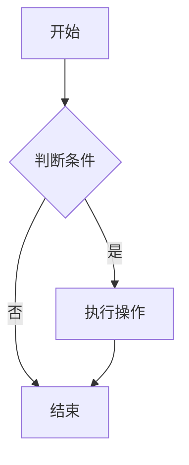
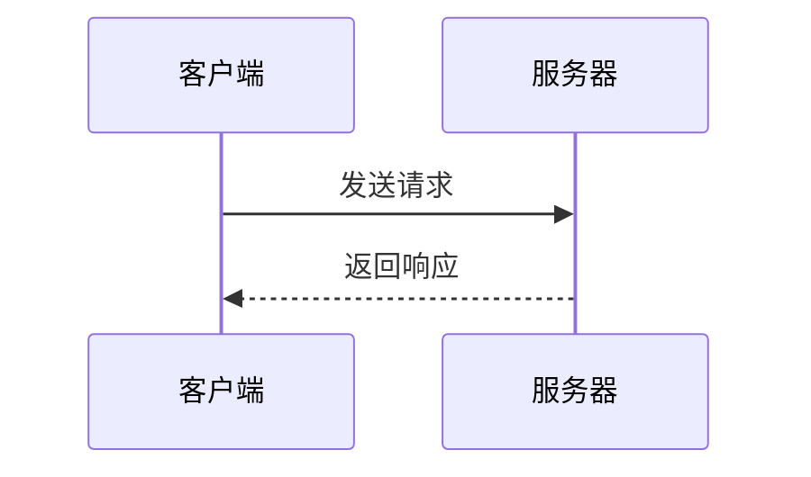

---
# 必填项
title: 文章标题                          # 文章标题（显示在页面顶部）
date: 2026-01-01 12:00:00 +0800         # 发布时间，格式：YYYY-MM-DD HH:MM:SS +时区

# 分类与标签（可选，但推荐填写）
categories: [一级分类, 二级分类]          # 最多两级分类，例如 [Tech, Database] 或 [Music, Guitar]
tags: [标签1, 标签2, 标签3]              # 可添加多个标签，小写英文，用于文章筛选

# 文章元信息（可选）
description: 文章摘要，显示在文章列表和页面副标题处。 # 建议控制在 100 字以内
author: Payne                           # 作者 ID，需在 _data/authors.yml 中定义

# 特性开关（可选）
pin: false          # 是否置顶文章（置顶文章显示在首页最前面）
toc: true           # 是否显示目录（右侧自动生成的 Table of Contents）
comments: true      # 是否开启评论
math: false         # 是否启用数学公式渲染（KaTeX）
mermaid: false      # 是否启用 Mermaid 流程图/时序图
---

<!-- ==================== 正文开始 ==================== -->
<!-- 以下内容展示常用 Markdown 语法，请在写作时删除不需要的示例 -->

## 一级标题（H2）

> Chirpy 主题中，文章标题使用 H1（由 front matter 的 title 字段生成），
> 因此正文中的标题从 H2 开始，目录也只会显示 H2 及以下的标题。

### 二级标题（H3）

普通段落文字。支持 **加粗**、*斜体*、~~删除线~~、`行内代码`。

超链接写法：[链接文字](https://example.com)，也可以引用站内文章：[示例文章](/posts/memory_model/)

---

## 代码块

```cpp
// 指定语言可获得语法高亮，支持 cpp / python / bash / java / go 等
#include <iostream>

int main() {
    std::cout << "Hello, World!" << std::endl;
    return 0;
}
```

```bash
# Shell 命令示例
bundle exec jekyll serve --drafts   # 本地预览（含草稿）
bundle exec jekyll build            # 构建站点
```

---

## 列表

无序列表：
- 第一项
- 第二项
  - 子项（缩进两个空格）
  - 另一个子项

有序列表：
1. 步骤一
2. 步骤二
3. 步骤三

任务列表：
- [x] 已完成的任务
- [ ] 待完成的任务

---

## 图片

<!-- 图片放置在 assets/img/posts/<文章日期-文章名称>/ 目录下 -->


<!-- 带宽度限制的图片写法 -->
<!-- {: width="700" height="400"} -->

<!-- 带标题的图片 -->
<!-- {: .normal}
_图片说明文字_ -->

---

## 表格

| 列名 A | 列名 B | 列名 C |
|:-------|:------:|-------:|
| 左对齐 | 居中   | 右对齐 |
| 内容   | 内容   | 内容   |

---

## 引用

> 这是一段引用内容。
>
> 可以跨越多行。

---

## 数学公式（需在 front matter 中设置 `math: true`）

行内公式：$E = mc^2$

独立公式块：

$$
\sum_{i=1}^{n} i = \frac{n(n+1)}{2}
$$

---

## Mermaid 图表（需在 front matter 中设置 `mermaid: true`）





---

## 提示框（Chirpy 主题特有）

> **提示（Tip）**：使用 `{: .prompt-tip }` 显示绿色提示框。
{: .prompt-tip }

> **信息（Info）**：使用 `{: .prompt-info }` 显示蓝色信息框。
{: .prompt-info }

> **警告（Warning）**：使用 `{: .prompt-warning }` 显示黄色警告框。
{: .prompt-warning }

> **危险（Danger）**：使用 `{: .prompt-danger }` 显示红色危险框。
{: .prompt-danger }

---

## 折叠内容

<details>
<summary>点击展开详细内容</summary>

这里可以放一些不需要默认展示的内容，比如详细的推导过程、附录等。

</details>
