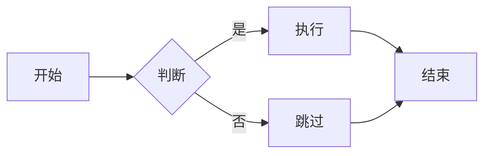

本文介绍如何在本项目（基于 Jekyll + Chirpy 主题）中**新增博客文章**，以及如何**编辑和自定义博客样式**。

---

## 项目结构概览

```
.
├── _config.yml          # 全局配置（标题、作者、评论、分页等）
├── _data/
│   └── authors.yml      # 作者信息
├── _layouts/            # 页面布局模板
├── _plugins/            # Jekyll 插件
├── _posts/              # 所有博客文章（Markdown 文件）
├── _tabs/               # 导航栏页面（About、Archives 等）
├── assets/
│   ├── img/
│   │   ├── avatar/      # 侧边栏头像
│   │   └── posts/       # 文章内图片（按文章名分目录）
│   └── css/             # 自定义样式（可在此覆盖主题样式）
└── index.html           # 首页入口
```

---

## 一、新增博客文章

### 1. 创建文章文件

所有博客文章放在 `_posts/` 目录下，文件命名格式必须严格遵循：

```
YYYY-MM-DD-文章名称.md
```

例如：

```
_posts/2026-02-22-my-new-post.md
```

> **注意**：文件名中的日期决定文章的发布顺序，文章名称部分建议使用小写英文字母和连字符，避免空格和特殊字符。

---

### 2. 编写文章头部信息（Front Matter）

每篇文章的 Markdown 文件开头需要包含 YAML 格式的元数据（Front Matter），写在两行 `---` 之间：

```yaml
---
title: 文章标题
date: 2026-02-22 12:00:00 +0800
categories: [一级分类, 二级分类]
tags: [标签1, 标签2]
description: 文章简介（显示在文章列表和 SEO 描述中）
author: Payne
pin: false       # 是否置顶（true/false）
math: false      # 是否启用数学公式渲染（KaTeX）
mermaid: false   # 是否启用 Mermaid 图表
---
```

各字段说明：

| 字段          | 类型      | 说明                                                           |
|---------------|-----------|----------------------------------------------------------------|
| `title`       | 字符串    | 文章标题，显示在页面顶部和文章列表中                           |
| `date`        | 日期时间  | 发布时间，格式 `YYYY-MM-DD HH:MM:SS +时区`，如 `+0800` 表示东八区 |
| `categories`  | 数组      | 最多两级分类，如 `[Tech, C++]`                                 |
| `tags`        | 数组      | 任意数量的标签，如 `[c++, server]`                             |
| `description` | 字符串    | 文章简短描述，用于 SEO 和列表预览                              |
| `author`      | 字符串    | 作者 ID，需在 `_data/authors.yml` 中定义                       |
| `pin`         | 布尔      | `true` 则将文章置顶显示在首页                                  |
| `math`        | 布尔      | `true` 则启用 KaTeX 数学公式渲染                               |
| `mermaid`     | 布尔      | `true` 则启用 Mermaid 流程图/时序图等                          |
| `image`       | 对象      | （可选）文章题图，见下文                                       |
| `last_modified_at` | 日期时间 | （可选）文章最后修改时间                                  |

---

### 3. 编写文章内容（Markdown）

Front Matter 之后就是正文内容，使用标准 Markdown 语法：

```markdown
## 一级标题（H2 起，H1 为文章标题）

### 二级标题

普通段落文字。

**加粗**，*斜体*，`行内代码`

> 引用块

- 无序列表
- 第二项

1. 有序列表
2. 第二项

---

代码块（指定语言可高亮）：

​```python
def hello():
    print("Hello, World!")
​```
```

---

### 4. 添加题图（可选）

在 Front Matter 中添加 `image` 字段：

```yaml
image:
  path: /assets/img/posts/2026-02-22-my-new-post/cover.jpg
  alt: 图片描述文字
```

图片文件存放在 `assets/img/posts/` 下对应文章名的目录中：

```
assets/img/posts/
└── 2026-02-22-my-new-post/
    ├── cover.jpg
    └── diagram.png
```

正文中引用图片：

```markdown

```

---

### 5. 数学公式（可选）

在 Front Matter 中设置 `math: true`，然后使用 KaTeX 语法：

```markdown
行内公式：$E = mc^2$

独立公式块：

$$
\int_{-\infty}^{\infty} e^{-x^2} dx = \sqrt{\pi}
$$
```

---

### 6. Mermaid 图表（可选）

在 Front Matter 中设置 `mermaid: true`，然后使用 Mermaid 语法：

````markdown

````

---

### 7. 添加新作者

如果是新作者发布文章，需要先在 `_data/authors.yml` 中添加作者信息：

```yaml
# 格式：
新作者ID:
  name: 显示名称
  twitter: Twitter用户名（没有可填 nullptr）
  url: https://github.com/你的GitHub用户名/
```

然后在文章的 Front Matter 中指定：

```yaml
author: 新作者ID
```

多作者文章：

```yaml
author: [作者1ID, 作者2ID]
```

---

## 二、编辑博客样式

本项目使用 [jekyll-theme-chirpy](https://github.com/cotes2020/jekyll-theme-chirpy) 主题。样式自定义有以下几种方式。

### 1. 全局配置修改（_config.yml）

`_config.yml` 提供了一些影响外观的配置项：

```yaml
# 颜色主题（留空则跟随系统，可切换亮/暗）
theme_mode: # [light | dark]

# 侧边栏头像
avatar: assets/img/avatar/avatar.jpg

# 是否开启 PWA 离线缓存
pwa:
  enabled: true
```

---

### 2. 覆盖主题 SCSS 样式

Chirpy 主题使用 SCSS 编写样式，可以通过在项目根目录创建对应路径的样式文件来覆盖主题默认样式。

在 `assets/css/` 目录下创建 `jekyll-theme-chirpy.scss`（若不存在则新建）：

```scss
---
---

@import 'main';

/* ===== 在此添加自定义样式 ===== */

/* 示例：修改文章正文字体大小 */
.content {
  font-size: 1.05rem;
}

/* 示例：修改代码块背景颜色（亮色模式） */
[light] .highlight,
.highlight {
  background: #f8f8f8 !important;
}

/* 示例：侧边栏背景色 */
#sidebar {
  background-color: #2a2a2a;
}
```

> **注意**：文件开头的两行 `---` 是必须的，Jekyll 需要通过它识别此文件并进行 SCSS 编译。

---

### 3. 自定义 CSS（不依赖 SCSS）

如果不想修改 SCSS，也可以直接在 `_layouts/default.html`（或其他布局文件）的 `<head>` 标签内添加 `<style>` 标签，或者引用自定义 CSS 文件。

在 `assets/css/custom.css` 中添加样式：

```css
/* 示例：修改文章标题颜色 */
article h1, article h2, article h3 {
  color: #333;
}
```

然后在布局文件中引入（谨慎修改布局文件，主题更新时可能被覆盖）。

---

### 4. 修改文章布局（_layouts/post.html）

`_layouts/post.html` 控制每篇文章页的结构和样式。可以直接修改此文件来调整文章页布局，例如：

- 添加或删除文章元信息（作者、日期等）
- 调整题图显示方式
- 修改页脚（标签、分类、版权信息）

---

### 5. 各分类样式对照参考

Chirpy 主题的主要 CSS class：

| 元素             | CSS class / 选择器              |
|------------------|---------------------------------|
| 文章正文         | `.content`                      |
| 文章标题         | `article h1`                    |
| 侧边栏           | `#sidebar`                      |
| 顶部导航         | `#topbar-wrapper`               |
| 代码块           | `.highlight`                    |
| 引用块           | `blockquote`                    |
| 标签             | `.post-tag`                     |
| 文章元信息       | `.post-meta`                    |

---

## 三、常见问题

**Q：新写的文章在本地/线上看不到？**

检查以下几点：
1. 文件名格式是否为 `YYYY-MM-DD-title.md`；
2. `date` 字段的时间是否超过当前时间（未来时间的文章不会显示）；
3. `_config.yml` 中 `timezone` 与 `date` 时区是否匹配；
4. 确认文件已正确提交并推送到 GitHub。

**Q：如何让文章只在本地查看（草稿）？**

将文章放入 `_drafts/` 目录（需自行创建），或将 `date` 设置为未来时间。

**Q：评论系统如何配置？**

本项目使用 Utterances 评论，基于 GitHub Issues。评论仓库配置在 `_config.yml` 中的 `comments.utterances.repo` 字段。

**Q：如何本地预览博客？**

```bash
# 安装依赖（仅首次需要）
bundle install

# 启动本地服务
bundle exec jekyll serve

# 浏览器访问
# http://127.0.0.1:4000
```

---

如有疑问或建议，欢迎在文章下方评论或直接向本项目提交 [Issue/PR](https://github.com/Paynezheng/Paynezheng.github.io)。
